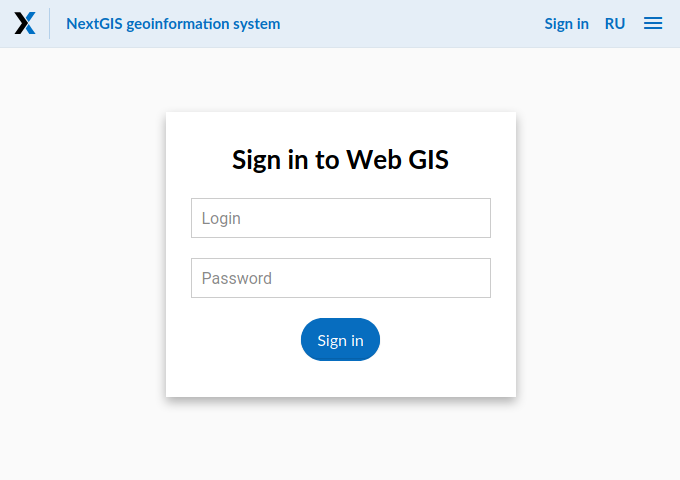

Deployment from pre-build images
================================

Requirements
------------

* Docker Engine >= 19.03
* Docker Compose >= 1.14

You also need pre-build docker images. Usualy URLs for pre-build images look
like: ``registry.example.com/some-path/service:version-additional-flags``.
Authorization in docker registry (via ``docker login registry.example.com``) may
be required.

Setup
-----

On docker host create working directory (``/srv/ngwdocker`` for example).

.. code-block:: shell

    $ mkdir /srv/ngwdocker
    $ cd /srv/ngwdocker

To store backups directly on docker host (instead of docker volume) also create
``backup`` directory:

.. code-block:: shell

    $ mkdir /srv/ngwdocker/backup

Create ``docker-compose.yaml`` using following example or file from your image
provider:

.. code-block:: yaml

    version: '3.7'
    services:
      app:
        image: registry.example.com/some-path/app:1-py2
        restart: unless-stopped
        volumes:
        - {type: volume, source: data_app, target: /opt/ngw/data/app}
        - {type: volume, source: config_app, target: /opt/ngw/config/app}
        - {type: volume, source: secret, target: /opt/ngw/secret}
        # To use docker host directory as backup storage (recomended):
        - {type: bind, source: ./backup, target: /opt/ngw/backup}
        # To use docker volume as backup storage uncomment following line:
        # - {type: volume, source: backup, target: /opt/ngw/backup}
        ports:
        # Bind directly to default HTTP port 80. If this port is busy,
        # then you can use another, for example 8080.
        - 80:8080
        depends_on:
        - postgres
      postgres:
        image: registry.example.com/some-path/postgres:1-py2-postgres10-postgis25
        restart: unless-stopped
        volumes:
        - {type: volume, source: data_postgres, target: /opt/ngw/data/postgres}
        - {type: volume, source: config_postgres, target: /opt/ngw/config/postgres}
        - {type: volume, source: secret, target: /opt/ngw/secret}
      archivist:
        image: registry.example.com/some-path/archivist:1-py2
        restart: unless-stopped
        volumes:
        - {type: volume, source: data_app, target: /opt/ngw/data/app}
        - {type: volume, source: data_postgres, target: /opt/ngw/data/postgres}
        - {type: volume, source: config_app, target: /opt/ngw/config/app}
        - {type: volume, source: config_postgres, target: /opt/ngw/config/postgres}
        - {type: volume, source: secret, target: /opt/ngw/secret}
        # To use docker host directory as backup storage (recomended):
        - {type: bind, source: ./backup, target: /opt/ngw/backup}
        # To use docker volume as backup storage uncomment following line:
        # - {type: volume, source: backup, target: /opt/ngw/backup}
    volumes:
      data_app: {}
      data_postgres: {}
      config_app: {}
      config_postgres: {}
      secret: {}
      # To use docker volume as backup storage uncomment following line:
      # backup: {}

After than run following command to pull images, create and start containers:

.. code-block:: shell

    $ docker-compose up -d

Wait some time and check logs with ``docker-compose logs`` to see progress.
After process completed you can access your web gis at: ``http://localhost/`` or
``http://hostname/``.

You can sign in to Web GIS with default login ``administrator`` and password
``admin``. Do not forget to change default password in control panel.

Backup and maintenance
----------------------

To run weekly backup weekly and maintenance create file ``cronjob`` with
following contents and set executable flag on it.

.. code-block:: shell

    $ cat <<EOF > cronjob
    #!/bin/bash
    set -ex
    PATH=/usr/local/sbin:/usr/local/bin:/usr/sbin:/usr/bin:/sbin:/bin
    docker-compose exec -T --env NGWDOCKER_INITIALIZE_DB=no \
        app /opt/ngw/bin/docker-entrypoint \
        bash -c "nextgisweb backup && nextgisweb maintenance"
    EOF
    $ chmod +x cronjob

This script starts nextgisweb online backup and then maintenance task. For more
info about backup and maintenance see relevant sections in this documentation.

Now add this script to run every sunday on 02:00 via cron and then restart it:

.. code-block:: shell

    $ cat <<EOF > /etc/cron.d/ngwdocker
    0 2 * * 0 root cd /srv/ngwdocker && ./cronjob
    EOF
    $ systemctl restart cron